# MDCN_PyTorch
### This repository is an official PyTorch implementation of the paper "MDCN: Multi-scale Dense Cross Network for Image Super-Resolution". (TCSVT 2020)

#### MDCN is an improved version of our previous work MSRN. More details about MSRN can be found in  <a href="https://github.com/MIVRC/MSRN-PyTorch">MDCN</a> 

### Paper can be download from <a href="https://ieeexplore.ieee.org/abstract/document/9208645/">MDCN</a> 

### Homepage: <a href="https://junchenglee.com/projects/TCSVT2020_MDCN/">MDCN</a> 

Convolutional neural networks have been proven to be of great benefit for single-image super-resolution (SISR). However, previous works do not make full use of multi-scale features and ignore the inter-scale correlation between different upsampling factors, resulting in sub optimal performance. Instead of blindly increasing the depth of the network, we are committed to mining image features and learning the interscale correlation between different upsampling factors. To achieve this, we propose a Multi-scale Dense Cross Network (MDCN), which achieves great performance with fewer parameters and less execution time. MDCN consists of multi-scale dense cross blocks (MDCBs), hierarchical feature distillation block (HFDB), and dynamic reconstruction block (DRB). Among them, MDCB aims to detect multi-scale features and maximize the use of image features flow at different scales, HFDB focuses on adaptively recalibrate channel-wise feature responses to achieve feature distillation, and DRB attempts to reconstruct SR images with different upsampling factors in a single model. It is worth noting that all these modules can run independently. It means that these modules can be selectively plugged into any CNN model to improve model performance. Extensive experiments show that MDCN achieves competitive results in SISR, especially in the reconstruction task with multiple upsampling factors. 

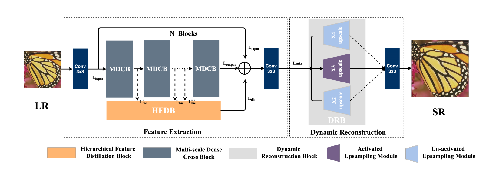

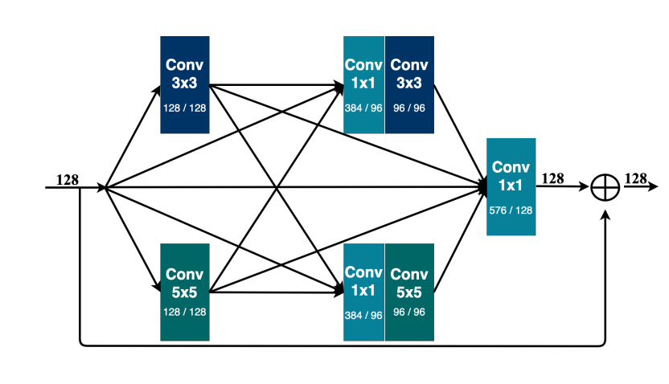

All reconstructed SR images can be download from <a href="https://www.jianguoyun.com/p/DSqeSXsQ19ySBxja5M4D">SR_Images</a> 

All test datasets (Preprocessed HR images) can be downloaded from <a href="https://www.jianguoyun.com/p/DcrVSz0Q19ySBxiTs4oB">here</a>.

All original test datasets (HR images) can be downloaded from <a href="https://www.jianguoyun.com/p/DaSU0L4Q19ySBxi_qJAB">here</a>.


## Prerequisites:
1. Python 3.6
2. PyTorch >= 0.4.0
3. numpy
4. skimage
5. imageio
6. matplotlib
7. tqdm

For more informaiton, please refer to <a href="https://github.com/thstkdgus35/EDSR-PyTorch">EDSR</a> and <a href="https://github.com/yulunzhang/RCAN">RCAN</a>.

## Document

Train/             : all train files are stored here

Test/              : all test files are stored here

README.md          : read me first


## Dataset

We used DIV2K dataset to train our model. Please download it from <a href="https://data.vision.ee.ethz.ch/cvl/DIV2K/">here</a>  or  <a href="https://cv.snu.ac.kr/research/EDSR/DIV2K.tar">SNU_CVLab</a>.

Extract the file and put it into the Train/dataset.

Only DIV2K is used as the training dataset, and Flickr2K is not used as the training dataset !!!

##Training

Using --ext sep_reset argument on your first running. 

You can skip the decoding part and use saved binaries with --ext sep argument in second time.

```python
cd Train/

Train single scale model
# MDCN x2    HR: 48 * 48

python main.py --template MDCN --save MDCN_x2 --scale 2 --reset --save_results --ext sep_reset

Train multiple scale model
# MDCN x234  HR: 48 * 48

python main.py --template MDCN --save MDCN_234 --scale 2+3+4 --reset --save_results --ext sep_reset
```

##Testing

All original test datasets (HR images) can be downloaded from <a href="https://www.jianguoyun.com/p/DaSU0L4Q19ySBxi_qJAB">here</a>.

Using pre-trained model for training, all test datasets must be pretreatment by  Prepare_TestData_HR_LR.m .

 The pre-trained model has been put in Test/model/ .

```python
cd Test/code/

Reconstruct single scale SR images
# MDCN x2

python main.py --data_test MyImage --scale 2 --model MDCN --pre_train ../model/MDCN_234.pt --test_only --save_results --chop --save "MDCN" --testpath ../LR/MLRBI --testset Set5

# MDCN+ x2

python main.py --data_test MyImage --scale 2 --model MDCN --pre_train ../model/MDCN_234.pt --test_only --save_results --chop --self_ensemble --save "MDCN_plus" --testpath ../LR/MLRBI --testset Set5


Reconstruct multiple scale SR images
# MDCN x2 x3 x4

python main.py --data_test MyImage --scale 2+3+4 --model MDCN --pre_train ../model/MDCN_234.pt --test_only --save_results --chop --save "MDCN" --testpath ../LR/MLRBI --testset Set5
```


## Performance

Our MDCN is trained on RGB. Following previous works, we only reported PSNR/SSIM on the Y channel in YCbCr space.


<p align="center">
  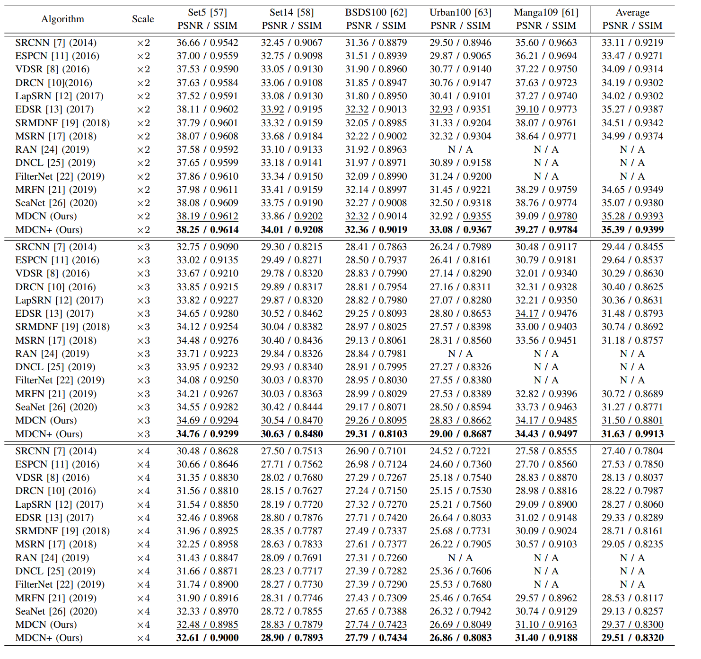 
</p>

<p align="center">
  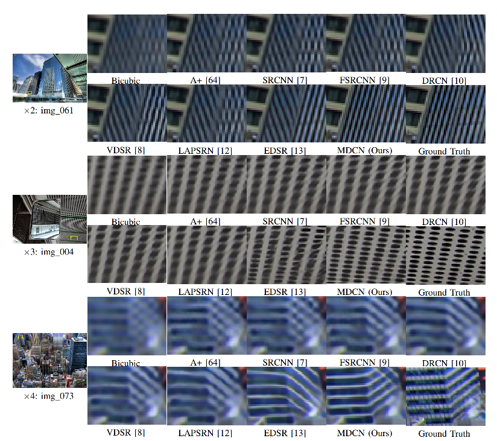 
</p>

<p align="center">
  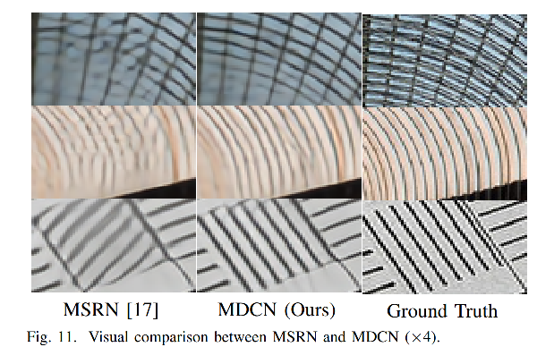 
</p>


## Convergence Analyses

MDCN x2 on DIV2K training dataset  and  validation dataset.

<p align="center">
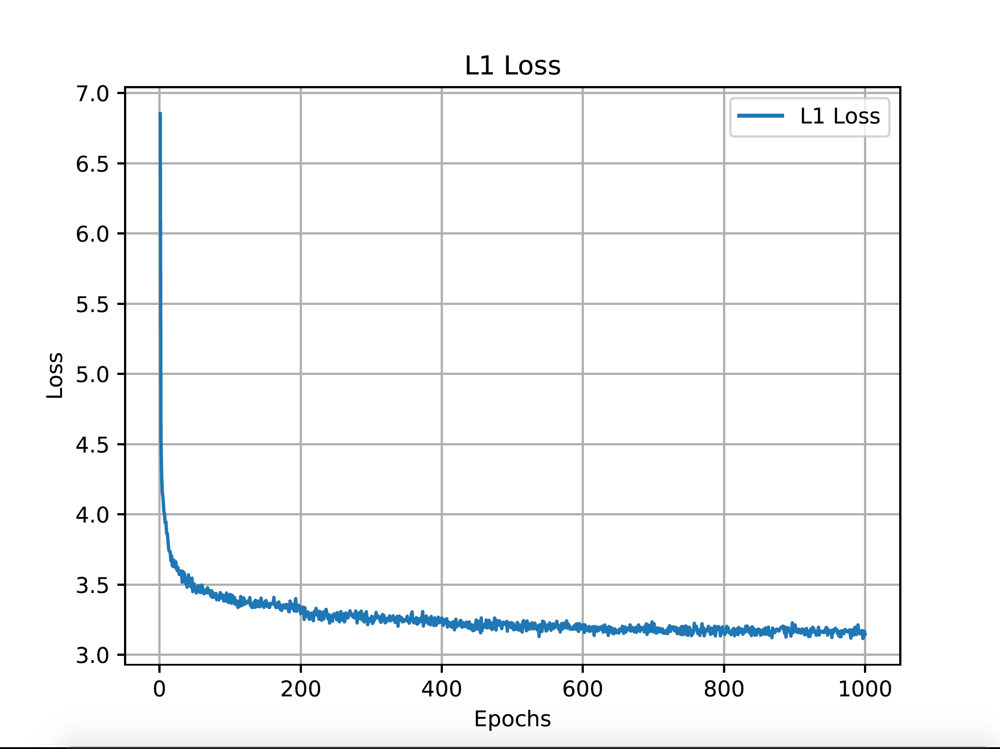 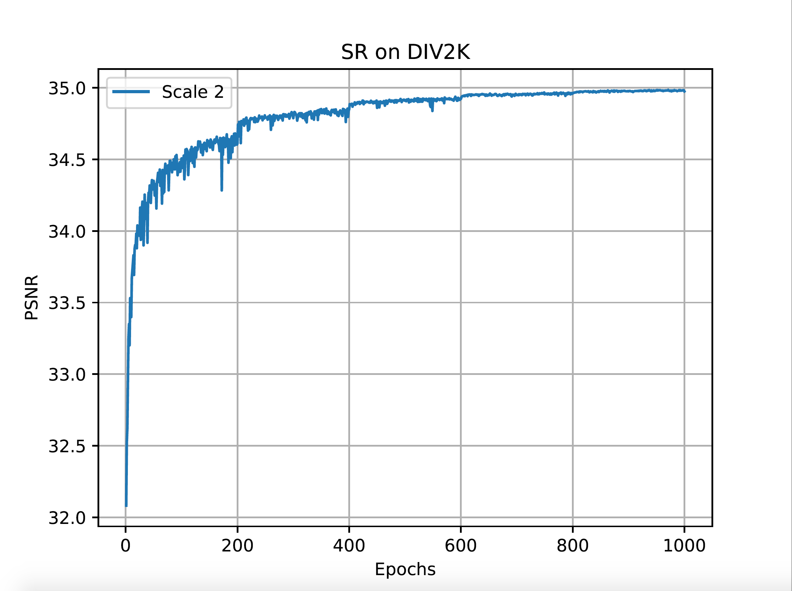 
</p>

MDCN x3 on DIV2K training dataset  and  validation dataset.

<p align="center">
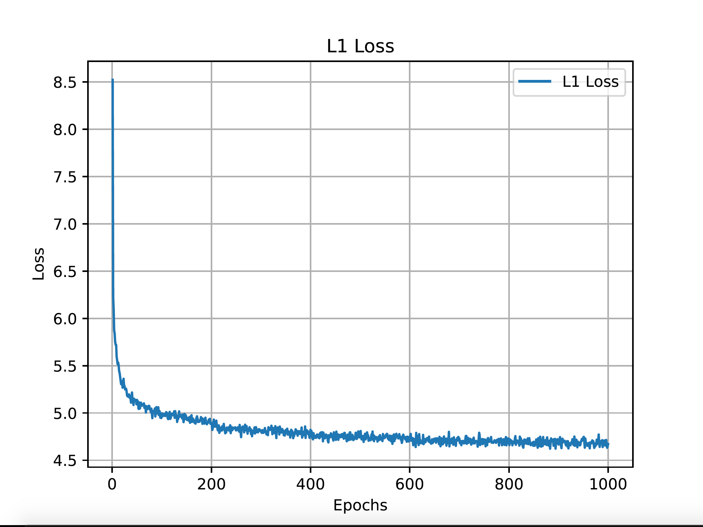 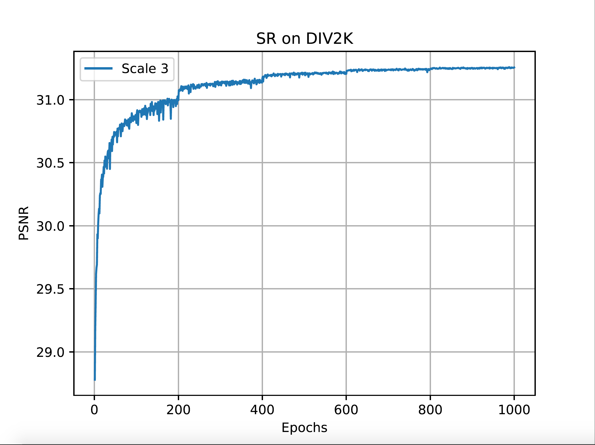 
</p>

MDCN x4 on DIV2K training dataset  and  validation dataset.

<p align="center">
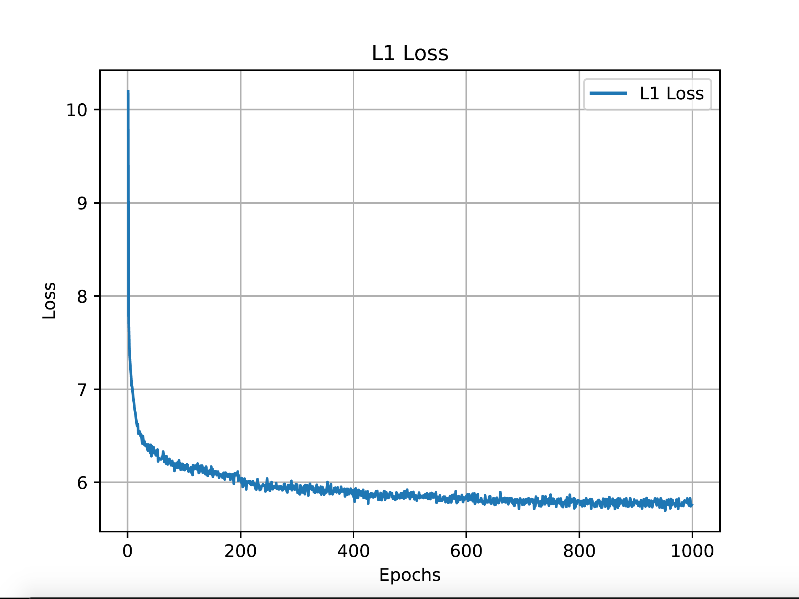 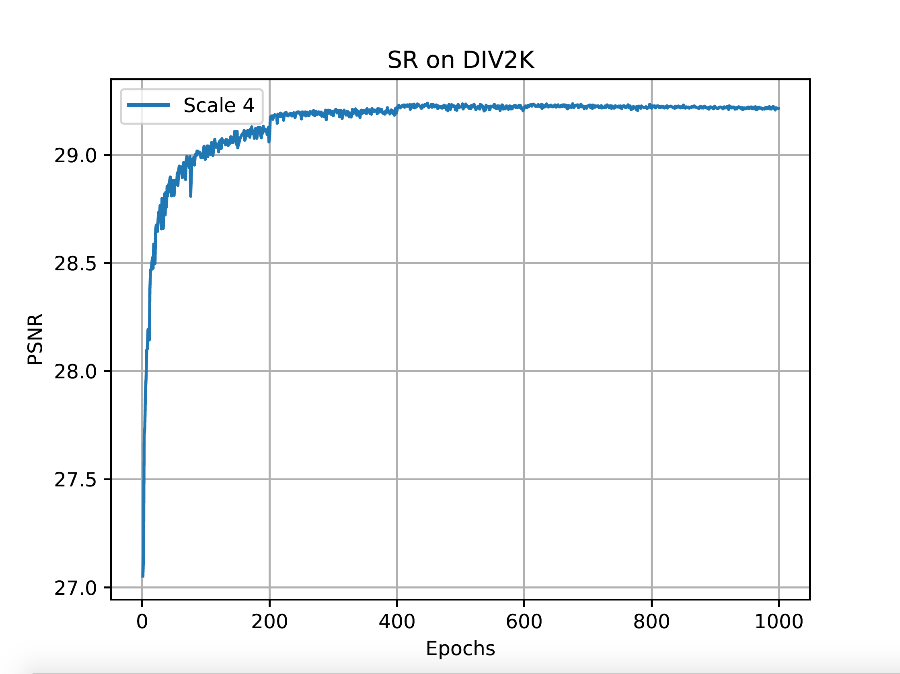 
</p>
This work was completed in 2019, a long time ago, so there may be omissions in the code finishing process. If you have any questions, please contact me!

```
@article{li2020mdcn,
  title={MDCN: Multi-scale Dense Cross Network for Image Super-Resolution},
  author={Li, Juncheng and Fang, Faming and Li, Jiaqian and Mei, Kangfu and Zhang, Guixu},
  journal={IEEE Transactions on Circuits and Systems for Video Technology},
  year={2020},
  publisher={IEEE}
}
```

```
@inproceedings{li2018multi,
  title={Multi-scale residual network for image super-resolution},
  author={Li, Juncheng and Fang, Faming and Mei, Kangfu and Zhang, Guixu},
  booktitle={Proceedings of the European Conference on Computer Vision (ECCV)},
  pages={517--532},
  year={2018}
}
```

This implementation is for non-commercial research use only. 
If you find this code useful in your research, please cite the above papers.